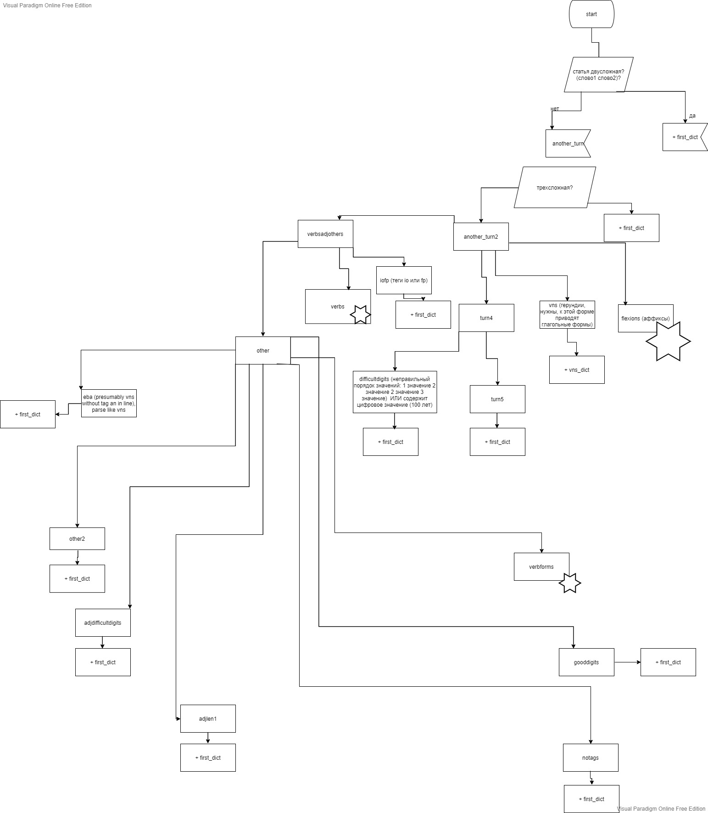

Самое важное содержится в тетради.

1) Скриптами и мануально был вычищен (насколько возможно) пдф-скан словаря Рейфилда
2) Сам словарь тоже нужен, потому что необходимо проверять в нем, какие слова распарсились алгоритмом, какие нет, где могут быть ошибки
3) Дальше строки из словаря парсились по дереву эвристик, структура на блок-схеме, часть строк отсеивалась, чтобы в дальнейшем придумать правила, которые смогли бы распарсить такие случаи
4) Глагольные формы преимущественно отделяются, т.к. парсер Мойера преимущественно приводит к герундию, который описывается в словаре как vn. Но парсер не всегда приводит к этой форме, поэтому иногда vt, vt3 и прочие глагольные формы тоже нужны.

Из файла newbeautiful14.txt полностью получается словарь, словари представлены в файлах parsed12-
Если мануально вычищать словарь, стоит сохранять его новую версию, т.к. есть вероятность что-то потерять, если правок очень много. Как вариант можно коммитить, чтобы была возможность откатиться к нужному коммиту.

Также что надо знать:
В словаре Рейфилда беглые гласные в круглых скобках типа ar(a), насколько помню, у Мойера дается без беглых гласных ar.
С другими беглыми? в квадратных скобках [] бывает по-разному.

Иногда в исходном словаре есть совпадающие словари (например, в каком-то из слов дается его форма в скобках, формы я также вношу в словарь), а потом статья с такой же последовательностью символов встречается самостоятельно. Надо как-то это объединять, чтобы статьи не замещали друг друга, т.к. в питоновском словаре значения перезпписываются.
Также это бывает при удалении пунктуации, например, есть ara~ как аффикс (или другое слово), есть самостоятельно. При удалении пунктуациии одно из значений будет замещено.

